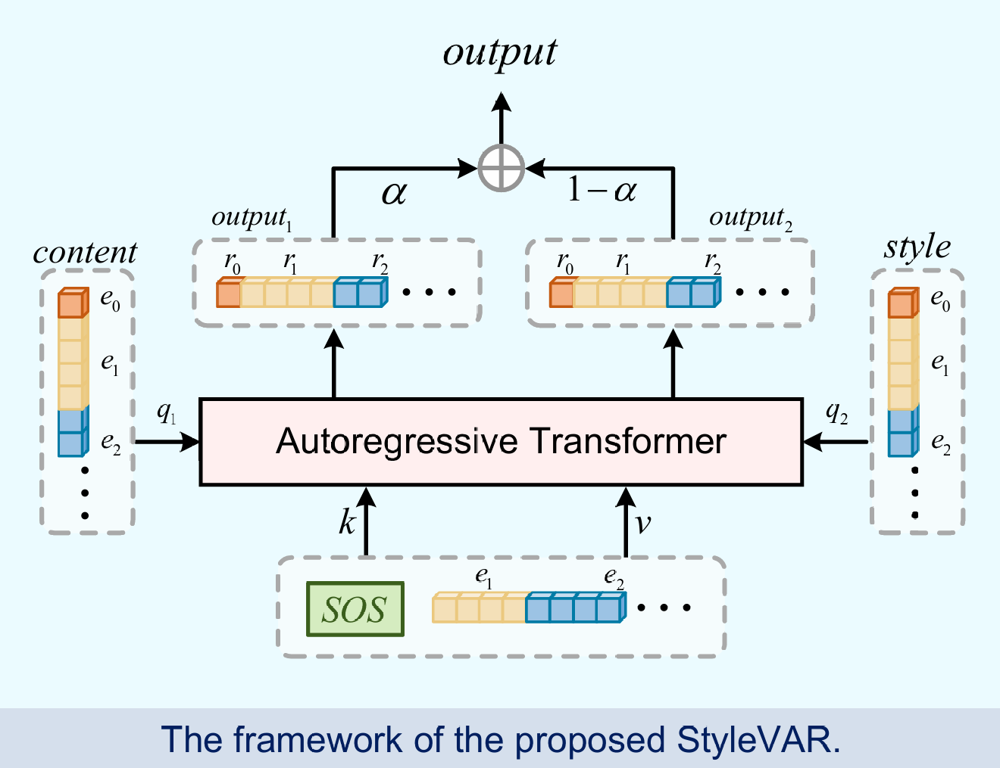

# StyleVAR: Controllable Image Style Transfer via Visual Autoregressive Modeling

[](LICENSE)
[](https://github.com/Senfier-LiqiJing/StyleVAR)
[](StyleVAR_Controllable_Image_Style_Transfer_via_Visual_Autoregressive_Modeling.pdf)


**StyleVAR** is a reference-based image style transfer framework built on Visual Autoregressive Modeling (VAR). We formulate style transfer as conditional discrete sequence modeling in a multi-scale latent space and introduce a **Blended Cross-Attention** mechanism that lets style and content features act as queries over the target's autoregressive history, preserving content structure while absorbing style texture. We train the model in two stages — supervised fine-tuning (SFT) on paired triplets, followed by GRPO reinforcement fine-tuning with a DreamSim-based perceptual reward and Per-Action Normalization Weighting (PANW) to rebalance credit across scales.

> **Authors**: Liqi Jing, Dingming Zhang, Peinian Li, Lichen Zhu
> **Affiliation**: Duke University

---

## Highlights

- **Image-only conditioning.** No text prompts; the model consumes a content image and a style image and generates the stylized output autoregressively over 10 scales ($1{\times}1 \to 16{\times}16$, $L=680$ tokens).
- **Blended Cross-Attention.** Style and content features serve as queries that re-weight the target's own history ($K$, $V$), preserving VAR's next-scale prediction paradigm.
- **Two-stage training.** SFT teaches the model to reproduce plausible stylizations from paired data; a second GRPO stage directly optimizes a perceptual DreamSim reward on the decoded image with LoRA adapters (rank 256).
- **Scale-aware credit assignment.** PANW down-weights the finest scales ($256\times$ token imbalance) so coarse scales that set layout and semantics still receive meaningful gradient.
- **Iterative reference update.** The KL anchor is periodically refreshed via peak-triggered merge, turning single-shot RFT into stable iterative GRPO.

---

## Table of Contents

- [Method](#method)
- [Installation](#installation)
- [Datasets](#datasets)
- [Training](#training)
- [Evaluation](#evaluation)
- [Inference](#inference)
- [Results](#results)
- [Limitations](#limitations)
- [Repository Layout](#repository-layout)
- [Citation](#citation)
- [References](#references)

---

## Method

### Blended Cross-Attention

Given a content image $x_c$ and a style image $x_s$, a shared VQ-VAE tokenizes each into multi-scale codes $C=\{c^1,\dots,c^K\}$ and $S=\{s^1,\dots,s^K\}$. The target image is generated scale by scale:

$$P(x \mid x_s, x_c) = \prod_{k=1}^{K} P\big(r^k \mid r^{<k}, s^k, c^k\big).$$

Within each transformer block, the target features are updated via

$$h_\text{new} = h + \Big[\alpha \cdot \text{Attn}(Q{=}s^k, K{=}h, V{=}h) + (1-\alpha) \cdot \text{Attn}(Q{=}c^k, K{=}h, V{=}h)\Big].$$

Assigning the target history to $K,V$ and the conditions to $Q$ keeps the autoregressive aggregation of $r^{<k}$ intact; style and content act as a *search query* over the target's own past rather than as a raw signal to copy from.



*Figure 1. The StyleVAR transformer with Blended Cross-Attention.*

### Stage 2: GRPO with PANW

After SFT, we add a second stage that optimizes a decoded-image reward with GRPO. For each triplet $(x_c, x_s, x)$ we sample $G=16$ rollouts from the current policy, decode each with the VQ-VAE, score with $R(\hat{x}, x) = -\lambda \cdot \text{DreamSim}(\hat{x}, x)$, and compute a group-relative advantage:

$$A^{(i)} = \frac{R^{(i)} - \text{mean}_j R^{(j)}}{\text{std}_j R^{(j)} + \varepsilon_\text{std}}.$$

To compensate for the $256\times$ token imbalance between the $1{\times}1$ and $16{\times}16$ scales, per-token losses are reweighted by

$$w_t = \frac{1}{Z}(h_k \cdot w_k)^{-\gamma}, \qquad \gamma \in [0.6, 0.8],$$

so that coarse scales receive roughly $60\times$ the per-token weight of the finest scale. The GRPO objective combines a PPO-style clipped surrogate with a Schulman k3 KL penalty against a reference policy; whenever the running reward surpasses the reference baseline by a meaningful margin, the LoRA delta is baked into the base and a fresh zero-initialized adapter is attached, converting single-shot RFT into iterative GRPO. An emergency merge fires if the raw KL exceeds 2.0 to prevent policy divergence.

See [GRPO.md](GRPO.md) for the full algorithm, hyperparameter history, and lessons learned.

---

## Installation

Requirements: Python 3.8+, PyTorch 2.0+, CUDA GPU (trained on a single NVIDIA 4090 48GB).

```bash
git clone https://github.com/Senfier-LiqiJing/StyleVAR.git
cd StyleVAR
pip install -r requirements.txt
```

Place the VQ-VAE and SFT/GRPO checkpoints under `ckpt/`:

```
ckpt/
├── vae_ch160v4096z32.pth          # frozen VQ-VAE
├── sft-best.pth                   # Stage 1 checkpoint
├── grpo-best.pth                  # Stage 2 merged checkpoint
└── clip-vit-base-patch32/         # for CLIP-Sim metric
```

---

## Datasets

Both training stages use a concatenation of two paired style-transfer datasets:

| Dataset | # Triplets | Role |
|---|---|---|
| [OmniStyle-150K](https://www.modelscope.cn/datasets/DiffSynth-Studio/OmniStyle) | 143,992 | Broad distribution of artistic styles over natural content |
| [ImagePulse-StyleTransfer](https://www.modelscope.cn/datasets/DiffSynth-Studio/ImagePulse-StyleTransfer) | 137,886 | Additional stylization diversity and content domain coverage |

The two corpora are merged into a single **267,710-sample** training set with a 95/5 train/val split. During SFT we apply rotation and brightness perturbations to content images and random cropping to style images; GRPO rollouts are performed without augmentation to keep the conditioning signal deterministic across the $G$ samples in a group.

For out-of-distribution evaluation we additionally construct random (COCO, WikiArt) content-style pairs that intentionally break the semantic correlation present in the paired training data.

Expected layout under `data/`:

```
data/
├── OmniStyle-150k/
├── ImagePulse/
├── coco2017/images/train2017/
└── wikiart/
```

---

## Training

### Stage 1 — Supervised Fine-Tuning

Initialize from the pretrained vanilla VAR checkpoint. The VQ-VAE is frozen; the full 600M transformer is fine-tuned. Because StyleVAR uses a dual-stream input (target features and content/style conditions), the original VAR projection layers for $Q/K/V$ are duplicated to produce distinct projections for the target and condition streams; FFNs inherit VAR's weights unchanged.

| Setting | Value |
|---|---|
| Epochs | 10 |
| Learning rate | $5\times10^{-4}$ (epochs 1-6) $\to$ $1\times10^{-4}$ (epochs 7-10) |
| Batch size (with grad-accum) | 128 |
| Hardware | 1× NVIDIA 4090 (48GB) |

### Stage 2 — GRPO Reinforcement Fine-Tuning

LoRA adapters ($r{=}256$, $\alpha/r{=}2$) are attached to every attention ($W_Q^\text{target}$, $W_{QKV}^\text{cond}$, $W_\text{proj}$) and FFN ($W_{\text{fc}1}$, $W_{\text{fc}2}$) linear, yielding 131M trainable parameters (18.2% of the backbone). The reference policy is realized *in place* by disabling the LoRA path during a forward pass on the same model, so no extra copy is kept in memory.

| Setting | Value |
|---|---|
| Reward | $R = -\lambda \cdot \text{DreamSim}(\hat{x}, x)$, $\lambda{=}5.0$ |
| Group size $G$ | 16 |
| Sampling | top-$k{=}900$, top-$p{=}0.96$ |
| Clip ratio $\varepsilon$ | 0.2 |
| KL coefficient $\beta$ | 0.1 |
| PANW exponent $\gamma$ | 0.7 |
| Optimizer | AdamW, lr $1\times10^{-5}$, wd 0.01, $(\beta_1,\beta_2){=}(0.9, 0.95)$ |
| Precision | FP32 (mixed precision caused $\log\pi_\theta$ drift between rollout and update) |
| Merge gain / patience / cool-down | $\tau_\text{gain}{=}0.05$ / $\tau_\text{patience}{=}50$ / 300 steps |
| Emergency merge | raw KL $> 2.0$, 50-step cool-down |
| Hardware | 1× NVIDIA 4090 (48GB), physical batch 16, $G{=}16$ serial rollouts |

### Commands

```bash
# Stage 1 (SFT)
bash scripts/run_train.sh       # if you have your own SFT launcher

# Stage 2 (GRPO) — starts from ckpt/sft-best.pth by default
bash scripts/run_grpo_v5.sh

# Merge a GRPO LoRA checkpoint back into the SFT base
python scripts/merge_grpo_lora.py \
  --sft_ckpt  ckpt/sft-best.pth \
  --grpo_ckpt grpo_output_v5/grpo_best.pth \
  --out       ckpt/grpo-best.pth
```

---

## Evaluation

One-click evaluation on all three benchmarks (OmniStyle in-domain, ImagePulse near-domain, COCO+WikiArt out-of-domain):

```bash
bash scripts/run_eval.sh ckpt/grpo-best.pth eval_out_grpo     # evaluate GRPO
bash scripts/run_eval.sh ckpt/sft-best.pth  eval_out_sft      # evaluate SFT baseline
bash scripts/run_eval.sh --also_adain --skip_stylevar         # AdaIN baseline only
```

Reported metrics: Style Loss (VGG-19 Gram), Content Loss (VGG-19 `conv4_2`), LPIPS, SSIM, DreamSim, CLIP-Sim, plus per-sample inference time.

---

## Inference

```bash
python eval/infer_grpo.py \
  --grpo_ckpt ckpt/grpo-best.pth \
  --sft_ckpt  ckpt/sft-best.pth \
  --num 8 --out grpo_infer_results.png
```

Pass `--sft_only` to visualize the SFT baseline without loading a LoRA checkpoint. The script also produces a side-by-side SFT/GRPO comparison grid.

---

## Results

We compare StyleVAR (SFT and GRPO) against an AdaIN baseline on three benchmarks spanning in-, near-, and out-of-distribution regimes. Arrows indicate whether higher ($\uparrow$) or lower ($\downarrow$) is better. **Best** is bold; <ins>second best</ins> is underlined.

| Dataset | Method | Style Loss $\downarrow$ | Content Loss $\downarrow$ | LPIPS $\downarrow$ | SSIM $\uparrow$ | DreamSim $\downarrow$ | CLIP Sim $\uparrow$ | Infer (s) $\downarrow$ |
|---|---|---|---|---|---|---|---|---|
| **OmniStyle** | AdaIN          | 0.0625 | 198.3449 | 0.7506 | 0.1421 | 0.6522 | 0.6555 | **0.0079** |
|               | StyleVAR (SFT) | <ins>0.0468</ins> | <ins>116.3569</ins> | <ins>0.4743</ins> | <ins>0.3975</ins> | <ins>0.2276</ins> | <ins>0.8704</ins> | 0.4031 |
|               | StyleVAR (GRPO)| **0.0466** | **114.5686** | **0.4656** | **0.4024** | **0.2164** | **0.8740** | 0.4031 |
| **ImagePulse**| AdaIN          | 0.0735 | 223.4699 | 0.7802 | 0.1574 | 0.6958 | 0.5651 | **0.0029** |
|               | StyleVAR (SFT) | <ins>0.0452</ins> | **180.7923** | <ins>0.5618</ins> | <ins>0.4282</ins> | <ins>0.3168</ins> | <ins>0.7903</ins> | 0.4031 |
|               | StyleVAR (GRPO)| **0.0387** | <ins>182.0954</ins> | **0.5572** | **0.4320** | **0.2979** | **0.8000** | 0.4031 |
| **COCO+WikiArt** | AdaIN       | 0.0282 | 171.0877 | 0.7688 | 0.1985 | 0.7536 | 0.5319 | **0.0027** |
|               | StyleVAR (SFT) | <ins>0.0206</ins> | <ins>160.1233</ins> | <ins>0.7398</ins> | **0.2713** | <ins>0.6986</ins> | <ins>0.5308</ins> | 0.4031 |
|               | StyleVAR (GRPO)| **0.0199** | **157.5109** | **0.7286** | <ins>0.2677</ins> | **0.6793** | **0.5335** | 0.4031 |

*Table 1. Cross-model and cross-dataset evaluation. Inference time measured on a single NVIDIA A100 (40GB).*

**Observations.**
- Both StyleVAR variants consistently outperform AdaIN on every quality-oriented metric across all three datasets, with the largest gains on SSIM (up to **+0.26** on OmniStyle) and LPIPS (up to **−0.28** on OmniStyle) — evidence that the autoregressive multi-scale formulation preserves content structure far more faithfully than channel-wise feature statistics matching.
- GRPO improves over the SFT checkpoint on the majority of metrics on every dataset, most notably DreamSim and CLIP similarity — the two signals aligned with the reinforcement reward — confirming that reward-guided fine-tuning sharpens the SFT-learned style/content trade-off without destabilizing the policy.
- AdaIN retains a roughly two-orders-of-magnitude advantage in inference cost, reflecting the gap between a single feed-forward pass and a 10-scale autoregressive procedure.

### Training Dynamics


*Figure 2. Stage 1 SFT loss (left) and top-$k$ accuracy (right) across global iterations.*

---

## Limitations

- **Generalization gap on internet images.** OmniStyle-150K's ~150K triplets come from only ~1,800 unique content images. At 600M parameters, StyleVAR partially memorizes this limited content pool rather than learning a fully generalized content representation.
- **Human faces.** Facial topology is structurally more sensitive and perceptually more scrutinized than natural scenes; the model performs well on landscapes and architecture but struggles on faces.
- **Sampling cost.** 10-scale autoregressive decoding is ~128$\times$ slower than AdaIN. Closing this gap through distillation or parallel decoding is left to future work.

---

## Repository Layout

```
StyleVAR/
├── train/                       # training entry points
│   ├── train_grpo.py            # Stage 2 GRPO loop
│   ├── train_sft.py             # Stage 1 SFT loop
│   └── sft_trainer.py
├── eval/                        # evaluation and inference
│   ├── eval_grpo.py             # metrics on OmniStyle / ImagePulse / COCO+WikiArt
│   ├── infer_grpo.py            # qualitative side-by-side generation
│   ├── adain.py                 # AdaIN baseline
│   └── {content_style_loss,LPIPS,SSIM}.py
├── scripts/                     # one-click shell + merge utilities
│   ├── run_grpo_v5.sh
│   ├── run_eval.sh
│   └── merge_grpo_lora.py
├── models/                      # StyleVAR transformer + VQ-VAE
├── utils/                       # LoRA, data, AMP, LR control
│   └── lora.py                  # canonical LoRA + checkpoint helpers
├── assets/                      # paper figures (sample.png, framework.png, ...)
├── GRPO.md                      # detailed GRPO design notes
└── README.md
```

---

## Citation

```bibtex
@article{jing2026stylevar,
  title   = {StyleVAR: Controllable Image Style Transfer via Visual Autoregressive Modeling},
  author  = {Jing, Liqi and Zhang, Dingming and Li, Peinian and Zhu, Lichen},
  year    = {2026},
  note    = {Duke University}
}
```

---

## References

[1] Tian, K., Jiang, Y., Yuan, Z., Peng, B., & Wang, L. (2024). *Visual Autoregressive Modeling: Scalable Image Generation via Next-Scale Prediction.* NeurIPS 2024.

[2] Wang, Y., Liu, R., Lin, J., Liu, F., Yi, Z., Wang, Y., & Ma, R. (2025). *OmniStyle: Filtering High Quality Style Transfer Data at Scale.* CVPR 2025.

[3] Zhang, Y., Huang, N., Tang, F., Huang, H., Ma, C., Dong, W., & Xu, C. (2023). *Inversion-Based Style Transfer with Diffusion Models.* CVPR 2023.

[4] DiffSynth-Studio. *ImagePulse-StyleTransfer* [Dataset]. ModelScope.

[5] Lin, T. Y., Maire, M., Belongie, S., et al. (2014). *Microsoft COCO: Common Objects in Context.* ECCV 2014.

[6] WikiArt. *WikiArt: Visual Art Encyclopedia.* https://www.wikiart.org/

[7] DeepSeek-AI, Guo, D., Yang, D., et al. (2025). *DeepSeek-R1: Incentivizing Reasoning Capability in LLMs via Reinforcement Learning.* arXiv:2501.12948.

[8] Sun, S., Qu, L., Zhang, H., et al. (2026). *VAR RL Done Right: Tackling Asynchronous Policy Conflicts in Visual Autoregressive Generation.* arXiv:2601.02256.

[9] Fu, S., Tamir, N., Sundaram, S., Chai, L., Zhang, R., Dekel, T., & Isola, P. (2023). *DreamSim: Learning New Dimensions of Human Visual Similarity Using Synthetic Data.* NeurIPS 2023.

[10] Huang, X., & Belongie, S. (2017). *Arbitrary Style Transfer in Real-time with Adaptive Instance Normalization.* ICCV 2017.

---

## License

Released under the Apache 2.0 License — see [LICENSE](LICENSE).

**Acknowledgments.** This work builds on the Visual Autoregressive Modeling (VAR) framework and uses the OmniStyle-150K and ImagePulse-StyleTransfer datasets. We thank the authors for releasing their code and data.
